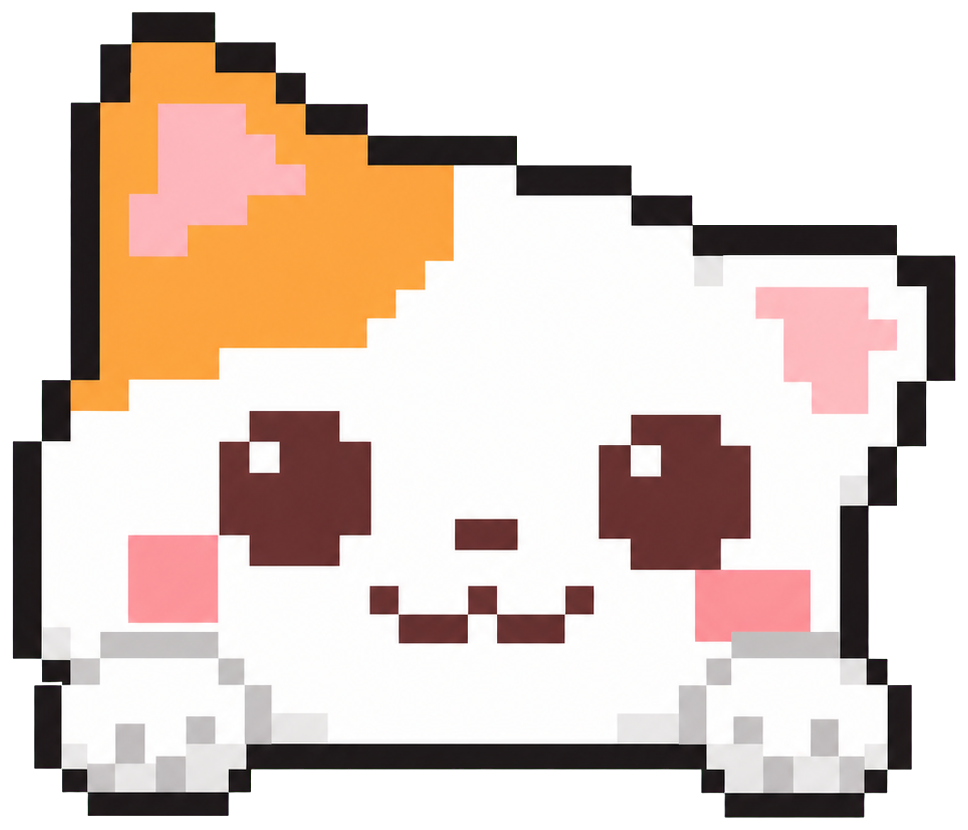

<div align="center">
  
  
  <h1>Mochi Desktop Cat 🐾</h1>
  <p>A tiny pixel cat that hangs around while you work.</p>
  
  
</div>

---

## Meet Mochi

Mochi is a tiny, always-on-top desktop companion made for long work and study sessions. It hangs from the edge of your screen using its paws, reacts when you pet it, meows when clicked, and stays out of the way when you need to focus.

No account. No tracking. No internet required. Just a small pixel cat keeping you company.

---

## ✨ Features

| Feature | What it does |
|---|---|
| 🐾 Petting reaction | Move your pointer over Mochi's head to make it smile and purr. |
| 🔊 Tiny meow | Click Mochi to hear a locally generated meow. |
| 📌 Four-corner snapping | Drag the paws and release to snap to the nearest screen corner. |
| 🙃 Upside-down mode | Mochi automatically hangs upside down in either top corner. |
| 💬 Little messages | Mochi occasionally reminds you to continue, stretch, or drink water. |
| 🔒 Private by design | Runs completely offline and collects no personal data. |
| 🪶 Minimal footprint | Uses a tiny 132 × 118 transparent window that avoids covering your work. |

---

## ⬇️ Download for Windows

1. Open the latest release.
2. Under **Assets**, download `Mochi-Desktop-Cat-Setup-0.1.0.exe`.
3. Run the installer.
4. Launch **Mochi Desktop Cat** from the desktop shortcut or Start menu.

> [!NOTE]
> This release is not currently code-signed, so Windows may display an **Unknown Publisher** warning during installation.

---

## 🎮 Controls

| Action | Result |
|---|---|
| Move the pointer over the head | Pet Mochi |
| Click the head | Meow and react |
| Double-click | Pixel sparks |
| Drag using the paws | Move Mochi |
| Release after dragging | Snap to the nearest corner |
| Right-click | Choose a corner, mute sounds, or quit |
| Alt + F4 | Close Mochi |

---

## 🧑‍💻 Run from source

You need **Node.js 20 LTS** or newer.

```bash
git clone https://github.com/narayanh15/mochi-desktop-cat.git
cd mochi-desktop-cat
npm.cmd install
npm.cmd start
```

---

## 📦 Build the Windows installer

```bash
npm.cmd run dist
```

The generated installer will be available inside the `dist` folder.

---

## 🎨 Make Mochi yours

- Edit the `messages` array in `app.js` to change what Mochi says.
- Replace the normal and happy PNG files in `assets/` to change the character.
- Edit `WINDOW_WIDTH`, `WINDOW_HEIGHT`, or the default corner in `main.cjs`.
- Adjust animation timing, size, and colors in `styles.css`.

---

## 🗂️ Project structure

mochi-desktop-cat/

├── assets/          # Pixel-art frames and README preview

├── app.js           # Petting, speech, sound, and reactions

├── index.html       # Cat UI structure

├── main.cjs         # Electron window and corner snapping

├── preload.cjs      # Restricted renderer bridge

├── styles.css       # Pixel styling and animations

└── package.json     # Scripts and installer configuration

---

## 🔐 Privacy

Mochi does not use analytics, advertisements, accounts, a camera, a microphone, or network requests. Messages and sounds are generated locally on your computer.

---

## 🤝 Contributing

Ideas, bug reports, artwork variants, and pull requests are welcome. If you build something fun, feel free to open an issue or submit a PR.

---

## 📄 License

Released under the **MIT License**.

---

<div align="center">
  <p>Made with JavaScript and pixels 🐈</p>
  <p>⭐ Star the repository if Mochi keeps you company.</p>
</div>
